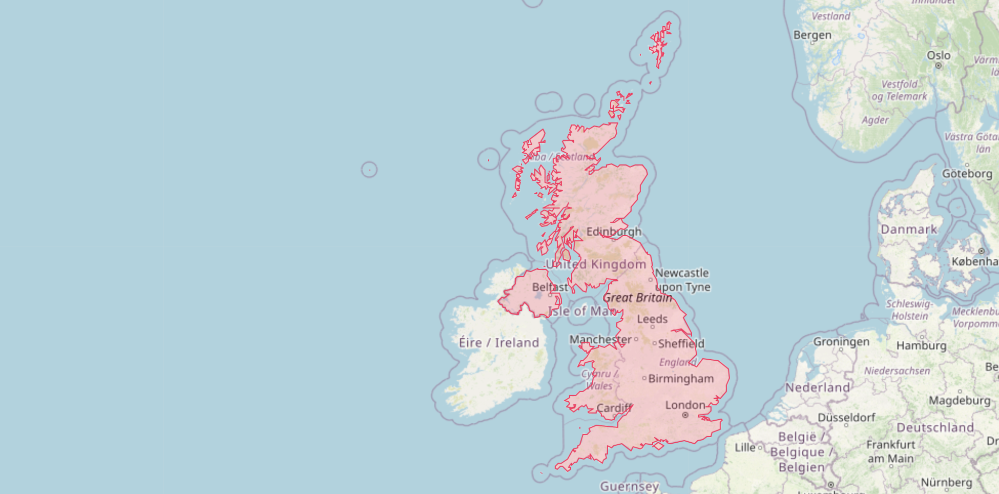

# 🗺️ Countries API

> **Archived :(**\
> This project has been archived and is no longer recieving bug fixes or security updates. You can still access a demo of this project at [ab-rnd-countries-demo.onrender.com](https://ab-rnd-countries-demo.onrender.com) that is subject to (~8 sec) cold starts.

---

Example: `/country/gb/outline`

---

A service for fetching country metadata and GeoJSON geometries, built with [Deno](https://deno.com/runtime) and the [Oak](https://oakserver.github.io/oak/) framework and published on [Docker Hub](https://hub.docker.com/r/abiddiscombe/countries). The data for this service is adapted from the [Countries GeoJSON](https://github.com/datasets/geo-countries) project, with all `-99` ISO_A3 features removed.

## API Endpoints
All endpoints permit a `GET` request and will return Geo/JSON. Where specified, an `isoCode` represents the official `ISO_A2` code of a country, [read more here](https://en.wikipedia.org/wiki/ISO_3166-1_alpha-3).

**`/`**\
Returns a list of the service's capabilities.

**`/country`**\
Returns a list of the countries supported by the API and a link to their metadata.

**`/country/:isoCode`**\
Returns the metadata (and links to related API capabilities) for the country represented by the `isoCode`.

**`/country/:isoCode/outline`**\
Returns a GeoJSON FeatureCollection containing a (multi)polygon feature to represent the outline of the specified country. This outline is designed for use at higher zoom levels and represents an approximation of the border.

**`/country/:isoCode/distance`**\
Requires a `point` query parameter in `lng,lat` format (e.g. `?point=-17.7986,64.7814`).\
Returns whether the `point` resides within the boundaries of the specified country, and if not, the minimum distance in kilometers to the border.

## No Database?
Prior to version 4.3.0, the Countries API used MongoDB to store each feature. These features are now stored as a local ~20 MB GeoJSON document which is read into memory at startup. Removing the database requirement results in:
- A simplified deployment process.
- Reduced costs of running the service.
- Reduced latency when handling requests.
- Further geospatial capabilities (via the [turf](https://turfjs.org/) module).

## Deployment Instructions
Deploying an instance of the Countries API is as simple as pulling the image, `abiddiscombe/countries`, from [Docker Hub](https://hub.docker.com/r/abiddiscombe/countries) and starting the server (on internal port 8080).\
The deployment can be customised via environment variables:

- `AUTH_TOKEN`\
If you are deploying the service to be accessed behind an API gateway or proxy, you can set a [Bearer Token](https://swagger.io/docs/specification/authentication/bearer-authentication/) to be used across all endpoints. The server will accept a string for use as a security token with a minimum length of 20 characters. **If a token is not supplied, authentication will be disabled**.

- `CORS_ORIGIN`\
Accepts a single, valid, domain name can be whitelisted via CORS response headers. **If nothing is provided, CORS will be configured to accept all origins via a wildcard.**

- `FLAGS_API`\
Permits the user to specify whether the API should include links to country flags, which are hosted externally via [Flagpedia.net](https://flagpedia.net/). Accepts the following strings: `true` (default), and `false`.
